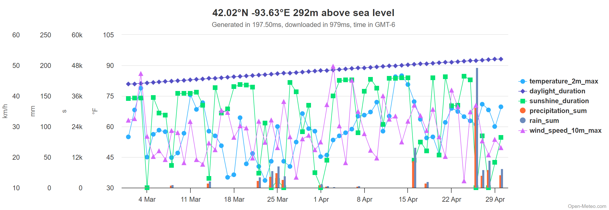
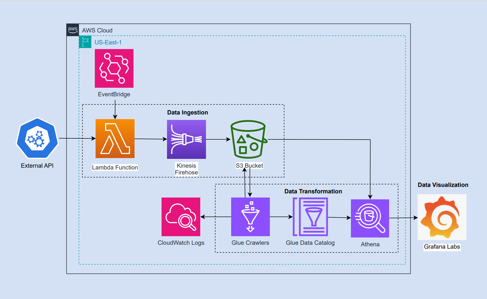
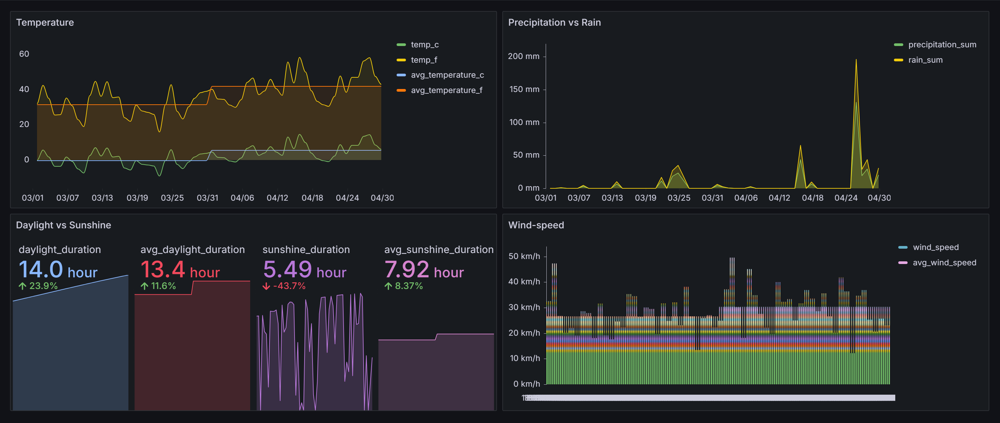

# Ames Weather Data ETL Pipeline
# Table of Contents

1. [Project Description](#project-description)
2. [Weather Data Variables](#weather-data-variables)
3. [Visual Overview of Data](#visual-overview-of-data)
4. [key Questions to Answer](#key-questions-to-answer)
5. [Tech Stack](#tech-stack)
6. [Data Pipeline Architecture](#data-pipeline-architecture)
7. [Data Pipeline Description](#data-pipeline-description)
8. [Dashboard](#dashboard)
9. [Key Findings](#key-findings)
10. [Limitations](#limitations)
11. [Acknowledgement](#acknowledgement)
12. [License](#license)
   
## Project Description

This project delves into the weather patterns of Ames, Iowa, specifically focusing on the months of March and April 2024. Our aim is to gain insights into various key weather variables during this period. To achieve this, we employed a systematic approach, starting with data collection using the Open-Meteo API, a reliable open source of weather data. The collected data was then processed through a robust data pipeline built on AWS infrastructure.

In the data collection phase, we utilized AWS Lambda and Kinesis Firehose to ingest the weather data into our system. AWS Lambda, triggered by an EventBridge schedule, periodically fetched the latest weather information from the Open-Meteo API. This data was then streamed into an S3 bucket using Kinesis Firehose, ensuring efficient and real-time data ingestion.

Once the data was ingested, we focused on transforming it into a usable format for analysis. This involved the use of AWS Glue, where Glue Crawler automatically scanned the data in the S3 bucket, identifying its schema and structure. The metadata catalog created by Glue Crawler facilitated smooth data processing and transformation through Glue Jobs. These jobs cleaned, enriched, and structured the data, preparing it for further analysis.

For querying the processed data, we turned to Amazon Athena, a powerful and serverless query service. With Athena, we ran SQL queries directly on the data stored in S3, allowing for seamless and efficient data analysis.

The significance of this project lies in the insights it uncovers regarding local climate conditions in Ames, Iowa. By analyzing key weather variables such as average temperatures, daylight and sunshine duration, and precipitation amounts, we gain valuable information about the weather patterns during March and April 2024. These insights have implications for various sectors, including agriculture, tourism, transportation, and urban planning.
 
 

## Weather Data Variables
The dataset includes weather data for Ames, Iowa from March 1, 2024, to April 30, 2024. The following variables were collected:

| Column Name          | Data Type | Description                                      |
|----------------------|-----------|--------------------------------------------------|
| time            | datetime  | The date and time of the recorded data point     |
| temperature_celsius  | float     | Temperature (at 2 meters abover the ground) in degrees Celsius (°C)     |
| temperature_fahrenheit | float   | Temperature (at 2 meters abover the ground) in degrees Fahrenheit (°F)  |
| daylight_duration    | float     | Duration of daylight in seconds (s)                   |
| sunshine_duration    | float     | Duration of sunshine in seconds (s)                   |
| precipitation_sum    | float     | Total precipitation in millimeters (mm)          |
| rain_sum             | float     | Total rainfall in millimeters (mm)                   |
| wind_speed           | float     | Maximum wind speed (at 10 meters abover the ground) in kilometers per hour (km/hr)            |
 
 

## Visual Overview of Data
The following chart (based on open-meteo API) provides overall summary of the data variables:

 
 

## key Questions to Answer

1. What were the average temperatures in Ames, Iowa, during March and April 2024?
2. How did daylight duration change between March and April 2024?
3. What was the trend in sunshine duration over these two months?
4. How much rain fell in March and April 2024, and how did the amounts compare between the two months?
5. What were the total precipitation sums for March and April 2024?
6. How did wind speeds vary between March and April 2024?

 
 

## Tech Stack

The project utilizes the following AWS services:

- **S3**: Used for storing raw and processed weather data.
- **Lambda Function**: Automated the data collection process by invoking the Open-Meteo API on demand.
- **Kinesis Firehose**: Streamed the collected weather data into specific S3 bucket on real-time.
- **Glue Crawler**: Scanned data in S3, identified its schema and created metadata catalog available for querying using AWS Athena.
- **Athena**: Used to run queries on the processed weather data stored in S3.
- **Glue Jobs**: Processed and transformed the data (performed serverless ETL functions).
- **Glue Workflows**: Orchestrated the workflow of the entire data pipeline, ensuring all tasks are executed in the correct order. 
- **Grafana Lab**: Used to produce dashboards based on the final processed data queried from Athena, providing interactive and visually appealing insights.

 
 

## Data Pipeline Architecture

## Data Pipeline Description

### 1) Data Ingestion
- **Data Collection**: 
  - **AWS Lambda**: An AWS Lambda function is used to collect weather data from the Open-Meteo API. This function is triggered by an **Amazon EventBridge** schedule, ensuring the data is collected at regular intervals.
- **Data Streaming**: 
  - **Amazon Kinesis Data Firehose**: The collected weather data is streamed into an Amazon S3 bucket using Amazon Kinesis Data Firehose. This service handles the real-time data ingestion, allowing for efficient and reliable delivery of streaming data into S3.

### 2) Data Transformation
- **Data Crawling**: 
  - **AWS Glue Crawler**: The AWS Glue Crawler scans the data stored in the S3 bucket. It automatically detects the schema and partitions of the data, and then creates a metadata catalog in the **AWS Glue Data Catalog**. This catalog makes the data easily accessible for querying and further processing.
- **Data Processing**: 
  - **AWS Glue Jobs**: AWS Glue Jobs are utilized to process and transform the ingested data. These ETL (Extract, Transform, Load) jobs clean, enrich, and structure the data according to the project's requirements, preparing it for analysis. In this project we performed four Glue Jobs: deleting old parquet table, creating new parquet table, quality checking of the parquet table (if any null value exhists) and publishing final production parquet table.
- **Data Logging**: 
  - **Amazon CloudWatch Logs**: CloudWatch Logs monitor and log the activity and status of the various AWS services used in the pipeline. This helps in troubleshooting and ensuring the smooth operation of the data pipeline.
- **Data Querying**: 
  - **Amazon Athena**: Amazon Athena is used to run SQL queries on the processed data stored in S3. It provides a serverless, interactive query service that makes it easy to analyze data directly in S3 using standard SQL.

### 3) Data Visualization
- **Dashboard**: 
  - **Grafana**: Grafana is connected to Amazon Athena to create dashboards based on the queried data. This open-source analytics and monitoring platform provides powerful visualization tools, enabling the creation of interactive and informative dashboards that present the analyzed weather data in an easily interpretable format.

 
 

## Dashboard

The project includes a dashboard ([Grafana:Snapshot](https://azizulislam1404.grafana.net/dashboard/snapshot/xJZkpdG4dRN6zIwJRsaK1EeQQIR3aToO)) that visualizes the collected and processed data. The dashboard provides insights into various weather parameters over the specified period.

 
 

## Key Findings

- The average temperatures (at 2 meters above the ground) in Ames, Iowa, for March and April 2024 were 31.4°F and 41.9°F, respectively.
- Daylight duration showed a gradual increase on average from March (11.9 hr) to April (13.4 hr).
- Sunshine duration also showed a slow, gradual increase on average from March (7.38 hours) to April (7.92 hours).
- The total rain sums were 339.3 mm in March and 1160.1 mm in April, respectively.
- The total precipitation sums were 226.2 mm in March and 773.4 mm in April, respectively.
- The average maximum wind speed (at 10 meters above the ground) was 26.8 km/hr in March and 30.34 km/hr in April.

 
 

## Limitations

- The data is limited to two months, which may not provide a comprehensive overview of long-term weather trends.
- In the raw data, we observed that the daily precipitation sum is lower than the rain sum, contradicting their definitions and necessitating further investigation.
- Limited variables collected; additional variables like humidity and pressure could enhance the significance of the project.
 
 

## Acknowledgement
  
I would like to express my sincere gratitude to David Freitag for his invaluable guidance and support throughout the completion of this project. His expertise and insights have been instrumental in navigating the complexities of weather data analysis and AWS services :clap: :clap: 
 
 
## License

This project is licensed under the MIT License - see the [LICENSE](LICENSE) file for details.

