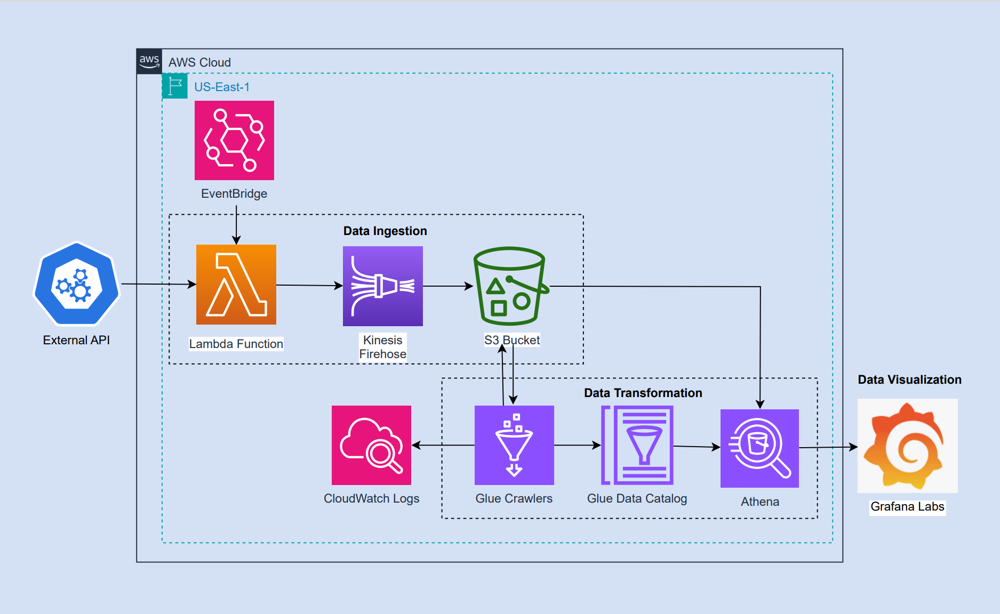

# Ames-Weather-March-April-2024

## Brief Project Description

This project provides an in-depth overview of the weather in Ames, Iowa for the months of March and April 2024. The data was collected using the Open-Meteo API, an open-source weather API, and processed through a data pipeline built using various AWS services. The project includes analysis of key weather variables and the creation of a comprehensive dashboard to visualize the findings.

## Dataset

The dataset includes weather data for Ames, Iowa from March 1, 2024, to April 30, 2024. The following variables were collected:
- Temperature (°C and °F)
- Daylight Duration
- Sunshine Duration
- Precipitation Sum
- Rain Sum
- Wind Speed

## Questions to Answer

1. What was the average temperature in Ames, Iowa during March and April 2024?
2. How did the duration of daylight and sunshine vary throughout these months?
3. What were the total precipitation and rain sums?
4. What was the average wind speed during this period?

## Tech Stack

The project utilizes the following AWS services:

- **S3**: Used for storing raw and processed data.
- **Lambda Function**: Automates the data collection process from the Open-Meteo API.
- **Kinesis Firehose**: Streams the collected data into S3.
- **Glue Crawler**: Crawls the data in S3 and creates a metadata catalog.
- **Athena**: Queries the data stored in S3.
- **Glue Jobs**: Processes and transforms the data.
- **Glue Airflows**: Orchestrates the workflow of the data pipeline.

## Data Pipeline Architecture



The data pipeline architecture involves the following steps:

1. **Data Collection**: AWS Lambda function triggers the Open-Meteo API to collect weather data.
2. **Data Streaming**: Data is streamed into an S3 bucket using Kinesis Firehose.
3. **Data Crawling**: Glue Crawler scans the data in S3 and creates a metadata catalog.
4. **Data Processing**: Glue Jobs process and transform the data as needed.
5. **Data Querying**: Athena is used to query the processed data for analysis.
6. **Workflow Orchestration**: Glue Airflows orchestrates the entire workflow, ensuring smooth execution of each step.

## Dashboard

The project includes a dashboard that visualizes the collected and processed data. The dashboard provides insights into various weather parameters over the specified period.


## Key Findings

- The average temperature in Ames, Iowa for March and April 2024 was X°C (Y°F).
- Daylight and sunshine duration showed a gradual increase from March to April.
- The total precipitation and rain sums were Z mm and W mm, respectively.
- The average wind speed during these months was V m/s.

## Limitations

- The data is limited to two months, which may not provide a comprehensive overview of long-term weather trends.
- Potential inaccuracies in the weather API data due to sensor errors or data processing issues.
- Limited variables collected; additional variables like humidity and pressure could enhance the analysis.

## To Replicate

1. Clone this repository:
   ```bash
   git clone https://github.com/yourusername/Ames-Weather-March-April-2024.git
